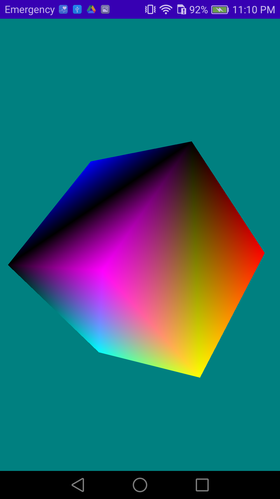

# Bouncy Cube

This app follow the tutorial from the book "Pro OpenGL ES for Android", by Mike Smithwick and Mayank Verma, on how to define and render a 3D cube that "bounces" inside the screen, using OpenGLES 1.0.

