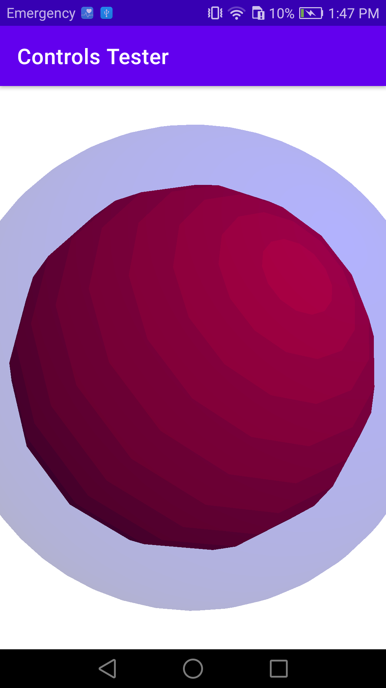

# Controls Tester

I made this app to practice the principles and techniques of moving 3D objects rendered with OpenGLES on an Android device. It displays a red sphere that you can rotate, zoom in/out and selecto to display a bluw boundary. The techqniques here followed are based on the books "Pro OpenGL ES for Android" by Mike Smithwick and Mayank Verma, and "OpenGL ES 2 for Android. A Quick-Start Guide" by Kevin Brothaler.

