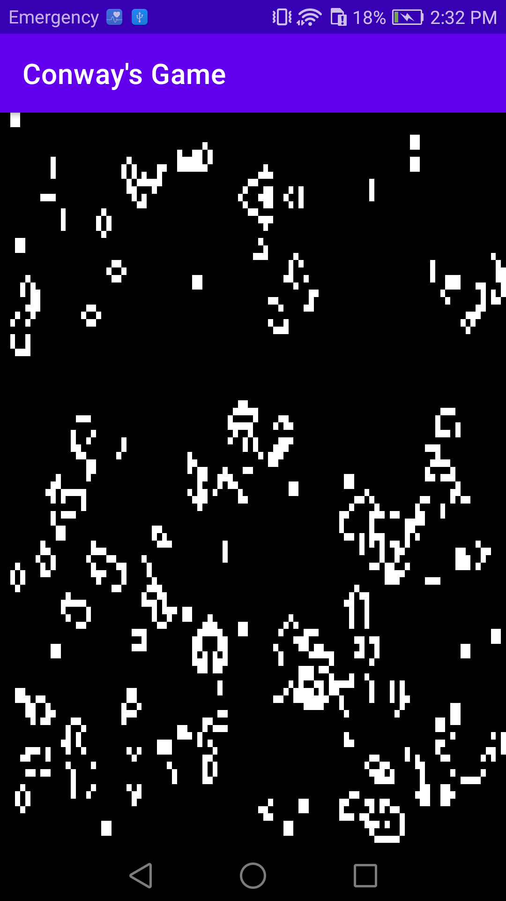

# Conway's Game of Life

This apps displays the zero-player [Game of Life](https://en.wikipedia.org/wiki/Conway%27s_Game_of_Life), using OpenGLES 2.0. It defines a cell as square and the color is defined by its state: dead means black and means is alive.

