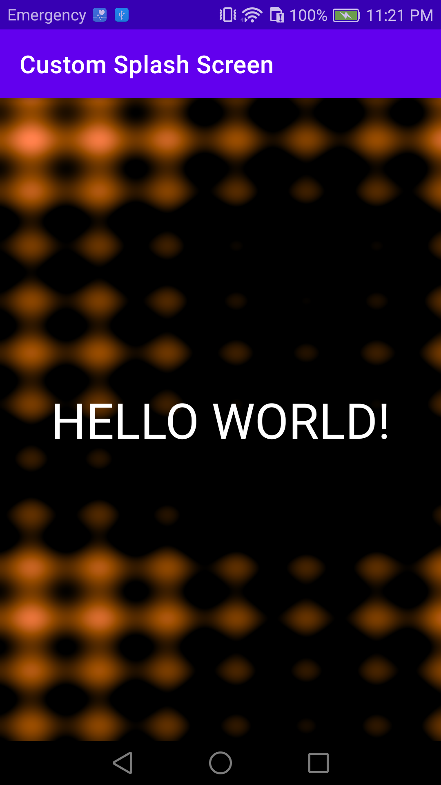

# Custom Splash Screen

I made this app to practice how to add a UI view and an OpenGL shader in the background on an Android device. It displays a shader with the message "Hello world!", implemented with an xml file. 

